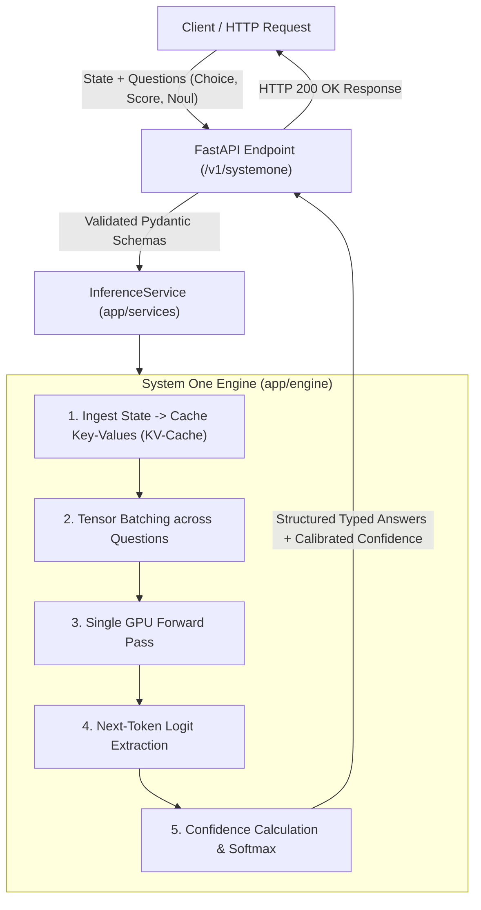

# Jev-Lite: Production-Grade System One Decision Engine

[](https://www.python.org/)
[](https://fastapi.tiangolo.com)
[](https://pytorch.org/)
[](https://huggingface.co/Qwen/Qwen2.5-0.5B)
[]()
[]()

**Jev-Lite** is a high-performance, non-autoregressive **System One Decision Engine** inspired by [TypeSafe AI](https://typesafe.ai). 

Standard large language models (LLMs) are designed for conversational text generation. Coercing a chatbot into outputting structured decisions creates latency, hallucinations, and parsing fragility. **Jev-Lite** evaluates complex state context against typed questions in a **single forward pass**, returning mathematical probability distributions, calibrated confidence scores, and structured data your backend code can consume directly.

---

## 🌟 Key Features

* **Zero Autoregressive Generation:** Evaluates choices and truth determinations directly via vocabulary projection logits in a single forward pass—no token-by-token loops.
* **One-Pass State KV-Caching:** Ingests long context/state once and shares the cached Key-Values across all questions.
* **Hardware-Accelerated Tensor Batching:** Packs dozens of questions into unified GPU tensor operations, saturating CUDA cores.
* **Calibrated Confidence Scoring:** Implements peak-spread confidence mathematics ($C = \frac{K \cdot p_{\max} - 1}{K - 1}$) to safeguard against model hallucinations.
* **Production-Grade FastAPI Stack:** Built with modern `lifespan` state management, non-blocking asynchronous thread offloading (`asyncio.to_thread`), and Pydantic v2 discriminated unions.

---

## 🧠 System One vs. Traditional Chatbots

| Dimension | Traditional Chatbot (GPT-4 / Claude) | Jev-Lite (System One) |
| :--- | :--- | :--- |
| **Output Type** | Free-form conversational text | **Strictly typed JSON, probabilities & confidence** |
| **Execution Loop** | Autoregressive (1 forward pass per word) | **Single forward pass (zero looping)** |
| **Output Token Cost**| Billed per generated token | **Free (0 output tokens generated)** |
| **Uncertainty** | Uncalibrated (hallucinates with 99% confidence)| **Calibrated distributions & explicit confidence metric** |
| **Software Usability**| Requires regex / JSON parsing with retries | **Direct code branching, routing, and scoring** |

---

## 📐 Architecture Overview



---

## 🧩 The 3 AI Primitives

Jev-Lite exposes three composable decision primitives:

| Primitive | Objective | Response Fields |
| :--- | :--- | :--- |
| **`Choice`** | Select the best option from dynamic criteria | `choice`, `probabilities`, `confidence` |
| **`Score`** | Calculate an expected value across rubric levels | `score`, `probabilities`, `confidence` |
| **`Noul`** | Determine whether a statement is True or False | `noul` (0.0 to 1.0 probability) |

All primitives can be mixed freely in a single request and are evaluated in parallel against the state.

---

## ⚡ Performance & Benchmarks

Benchmarked on a single **NVIDIA Tesla T4 GPU (16 GB)** using an enterprise support dispute state:

| Test Batch | Question Count | Total Latency | Latency Per Decision |
| :--- | :---: | :---: | :---: |
| **Batch 1** | 1 Question | **~35 ms** | 35.00 ms/q |
| **Batch 2** | 10 Questions | **~771 ms** | 77.18 ms/q |
| **Batch 3** | 30 Questions | **~2,004 ms** | 66.83 ms/q |
| **Batch 4** | **60 Questions** | **~4,281 ms** | **71.36 ms/q** |

> **Comparison:** Evaluating 60 independent questions with traditional chat LLMs requires generating ~1,000 output tokens, taking **15 to 30 seconds**. Jev-Lite delivers all 60 validated, typed decisions in **4.2 seconds** on a free T4 GPU.

---

## 🚀 Quickstart

### 1. Installation

Clone the repository and set up a virtual environment using `uv` (or `venv`):

```bash
git clone https://github.com/<YOUR_GITHUB_USERNAME>/jev-lite.git
cd jev-lite

# Create virtual environment (Python 3.11 or 3.12 recommended)
uv venv --python 3.11 .venv

# Activate environment
# On Linux/macOS/WSL:
source .venv/bin/activate
# On Windows PowerShell:
.venv\Scripts\activate

# Install dependencies in editable mode
uv pip install -e ".[dev]"
```

### 2. Run the Service Locally

```bash
uvicorn app.main:app --host 0.0.0.0 --port 8000 --reload
```

* **Interactive Swagger UI:** Visit [`http://localhost:8000/docs`](http://localhost:8000/docs)
* **ReDoc Documentation:** Visit [`http://localhost:8000/redoc`](http://localhost:8000/redoc)
* **Health Check:** `GET http://localhost:8000/v1/health`

---

## 📡 API Specification

### `POST /v1/systemone`

#### Request Payload:
```json
{
  "model": "jev-lite-0.1",
  "state": "Customer says: My credit card was charged twice ($49.99 x 2) for order #A-104. Please refund the extra charge immediately.",
  "questions": {
    "department": {
      "type": "choice",
      "instructions": "Which department should handle this ticket?",
      "criteria": {
        "billing": "Payments, credit card charges, or refunds",
        "tech_support": "App crashes or login errors",
        "shipping": "Delivery and tracking"
      }
    },
    "urgency": {
      "type": "score",
      "instructions": "Rate customer urgency level",
      "levels": {
        "1": "Low - General inquiry",
        "2": "Medium - Minor issue",
        "3": "High - Financial dispute or blocker"
      }
    },
    "is_refund": {
      "type": "noul",
      "statement": "The customer is asking for money to be refunded."
    }
  }
}
```

#### Response Payload (HTTP 200 OK):
```json
{
  "model": "jev-lite-0.1",
  "answers": {
    "department": {
      "type": "choice",
      "choice": "billing",
      "probabilities": {
        "billing": 0.7545,
        "tech_support": 0.0224,
        "shipping": 0.2230
      },
      "confidence": 0.6317
    },
    "urgency": {
      "type": "score",
      "score": 1.76,
      "probabilities": {
        "1": 0.4490,
        "2": 0.3409,
        "3": 0.2100
      },
      "confidence": 0.1735
    },
    "is_refund": {
      "type": "noul",
      "noul": 0.9395
    }
  }
}
```

---

## 🛠️ Codebase Structure

```text
jev-lite/
├── app/
│   ├── __init__.py
│   ├── main.py                  # FastAPI application & lifespan management
│   ├── core/                    # Core configuration & settings
│   │   ├── __init__.py
│   │   └── config.py            # Pydantic BaseSettings (12-Factor App)
│   ├── schemas/                 # Data contracts & DTOs (Pydantic v2)
│   │   ├── __init__.py
│   │   ├── request.py           # State, ChoiceQuestion, ScoreQuestion, NoulQuestion
│   │   └── response.py          # ChoiceAnswer, ScoreAnswer, NoulAnswer, SystemOneResponse
│   ├── engine/                  # Core Transformer Inference Engine
│   │   ├── __init__.py
│   │   ├── backbone.py          # Qwen CausalLM wrapper, KV-caching, logit scoring
│   │   ├── calibration.py       # Peak-spread confidence formula & temperature scaling
│   │   └── heads.py             # Optional modular projection heads
│   ├── services/                # Business & Orchestration Layer
│   │   ├── __init__.py
│   │   └── inference_service.py # Non-blocking threadpool offloader
│   └── api/                     # HTTP Transport Layer
│       ├── __init__.py
│       └── v1/
│           ├── __init__.py
│           ├── router.py        # API Router aggregator
│           └── endpoints.py     # POST /v1/systemone, GET /v1/models, GET /v1/health
├── scripts/
│   ├── test_client.py           # End-to-end client verification script
│   └── benchmark_fanout.py      # 60-question speculative fan-out benchmark
├── tests/                       # Unit & integration tests
├── pyproject.toml               # Project metadata & build dependencies
└── README.md
```

---

## ⚙️ Configuration (12-Factor App)

All parameters can be configured through environment variables or a `.env` file:

| Variable | Default Value | Description |
| :--- | :--- | :--- |
| `MODEL_NAME` | `"Qwen/Qwen2.5-0.5B"` | HuggingFace model backbone |
| `MODEL_VERSION` | `"jev-lite-0.1"` | Model version identifier |
| `DEVICE` | Auto-detected (`"cuda"` or `"cpu"`) | Compute execution device |
| `DEFAULT_TEMPERATURE` | `1.0` | Softmax temperature scaling |
| `API_TITLE` | `"Jev-Lite System One Engine"` | OpenAPI documentation title |

---

## 📄 License

This project is licensed under the Apache 2.0 License.
